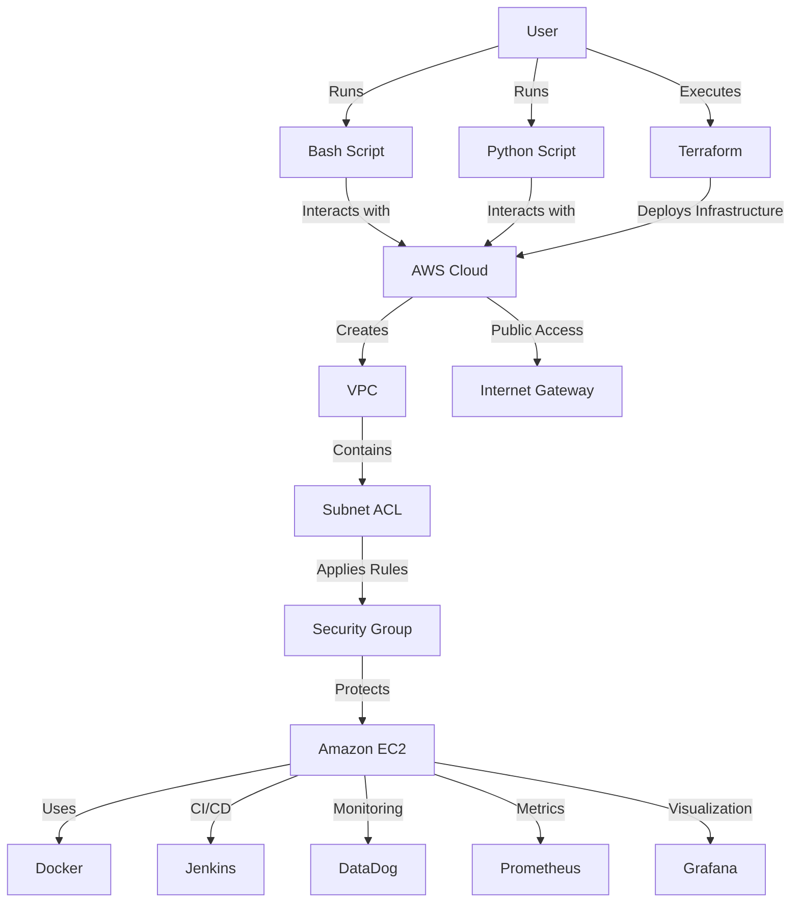

# 🌟 Comprehensive CI/CD Cloud Automation with Terraform, Python, and Real-Time Monitoring
**A complete CI/CD cloud automation system for managing infrastructure efficiently, integrating AWS services, Terraform, Python, and Jenkins for scalability, automation, and security.**  

 

---

## 🏆 Core Advantages
- **Automated Infrastructure** - Deploy AWS resources in minutes with Terraform.
- **CI/CD Pipeline** - Seamless deployment and version control via Jenkins.
- **AWS Automation** - Python Boto3 scripts for dynamic resource management.
- **Security Best Practices** - IAM policies, least privilege access, and encryption.
- **Real-Time Monitoring** - Centralized logging and Grafana dashboards.
- **Scalability** - Auto Scaling and Load Balancer integration.

## 🛠️ Technical Components
| Layer              | AWS Services                          |
|---------------------|---------------------------------------|
| **Compute**       | EC2, Auto Scaling                 |
| **Networking**      | Lambda, S3, Rekognition               |
| **Storage**         | EBS, S3                          |
| **CI/CD**    | Jenkins                                   |
| **Automation**   | Terraform, Python (Boto3)         |
| **Monitoring**      | CloudWatch, Grafana, Prometheus, DataDog |                   |

## 📂  Project Structure

Comprehensive-CI-CD-Cloud-Automation/
- ├── Python Script/       # AWS automation scripts using Boto3
- │   ├── create_delete_vpc.py
- │   ├── create_iam_user.py
- │   ├── manage_s3_bucket.py
- │   ├── create_ec2_instances.py
- │
- ├── Terraform Script/    # Infrastructure as Code (IaC) using Terraform
- │   ├── main.tf
- │   ├── variables.tf
- │   ├── outputs.tf
- │   ├── terraform.tfvars
- │   ├── jenkins_installation.sh
- │   ├── architecture_diagram.png
- │
- ├── User Data/           # Server initialization scripts
- │   ├── Install_Docker_Monitoring.sh
- │
- ├── README.md            # Project Documentation

## 🛠️ Technical Implementation
### 🏗️ AWS Architecture Stack

## 🤝 Connect with Me
- **LinkedIn**: [Ayman Mohamed](https://www.linkedin.com/in/ayman-mohamed1043/)
- **Notion**: [Project Documentation](https://yummy-success-abe.notion.site/Comprehensive-CI-CD-Cloud-Automation-with-Terraform-Python-and-Real-Time-Monitoring-19dd1728bdbc8034b032f2515ab948b2?pvs=4)
- **Terraform**: [Official Website](https://www.terraform.io/)
- **AWS**: [Amazon Web Services](https://aws.amazon.com/)

---
Thanks.

